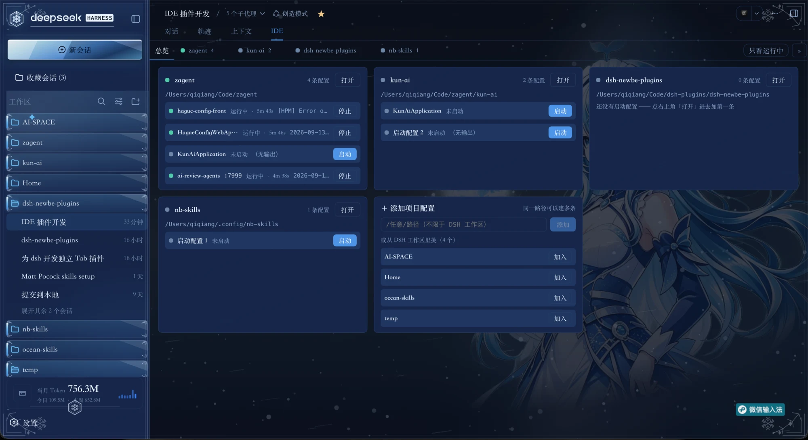
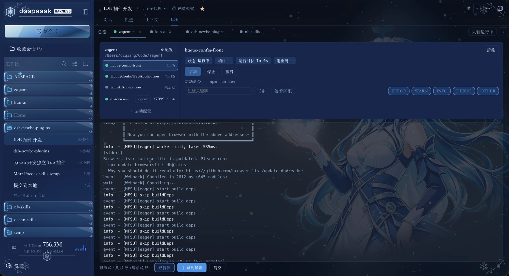

# dsh-newbe-ide

DSH Web 会话视图 tab「**IDE**」：按项目组织**启动配置**，一键启停、重启，日志实时滚动并留在浏览器里
（**不进模型上下文**）——把"起服务 / 跑命令 / 看输出"从 IntelliJ IDEA 搬到 DSH 里。





## 能力

- **会话视图 tab**：紧邻 `对话` / `轨迹` / `上下文` 的第四个 tab
- **按项目组织**：一个项目下可挂多条启动配置，各自独立进程与日志
- **一屏一张卡**：左列是这个项目的启动配置（状态点 / 端口 / 状态或运行时长），右列是选中那条的
  状态 / 端口 / 运行时长 / 退出码与启停重启键；启动命令与日志过滤都在同一张卡里
- **一键启停 / 重启**：停止按**进程组**回收，不留孤儿进程、端口立即释放
- **日志**：实时滚动、关键字与正则过滤、级别徽章（ERROR / WARN / INFO / DEBUG / OTHER）、
  自动跟随（向上滚动看历史时不会被拽回底部）、可暂停、可跳到最新、可清空视图
- **日志落盘**：跨 DSH 重启仍能读回上一次的输出（只保留一代轮转文件）
- **从 IDEA 导入**：读 `.idea/workspace.xml` 与 `.run/*.xml` 里的 Spring Boot 运行配置，
  连模块、主类与环境变量一起带过来
- **面板内编辑**：加项目、改启动命令 / 工作目录 / 环境变量；密钥类变量在界面上掩码
- **多项目**：tab 可横向滑动、可收起（配置保留）、`»` 列出全部项目、`只看运行中` 一键过滤
- **总览**：首位 tab 按项目分卡，卡内逐条列启动配置的状态、端口、时长与最后一行日志，
  点配置名直接跳过去；最后一张卡片用来添加项目配置
- **可以让 agent 帮你配**：内置一个 skill 与三个模型工具，在对话里说一句
  "把 `<目录>` 配好，跑起来看看" 即可

## 安装

```bash
# npm（推荐）
dsh plugin --profile web add dsh-newbe-ide

# GitHub 子目录
dsh plugin --profile web add github:qiqiangvae/dsh-newbe-plugins#path:packages/dsh-newbe-ide

# 锁定 commit
dsh plugin --profile web add 'github:qiqiangvae/dsh-newbe-plugins#<commit-sha>&path:packages/dsh-newbe-ide'
```

安装后需重启 `dsh web`（宿主侧的服务、接口、工具与 skill 都在进程启动时装配）。

## 用法

面板里自己配：

1. 「IDE」tab → 「总览」→ 最后一张卡片「**＋ 添加项目配置**」：选一个 DSH 工作区，或直接填
   **任意绝对路径**（路径不限于工作区，同一路径也可以建多条）
2. 进这个项目 → 项目名那一行最右端的「**⚙ 配置**」
3. 左列「**＋ 启动配置**」→ 填名称、启动命令、工作目录（留空 = 项目路径）→ 表单**底部**的「保存」
4. 回右列点「启动」；日志在下方，可过滤、暂停跟随、清空视图

也可以交给 agent。插件注册了三个工具与一个 skill，**装完即用**（不需要改 preset，
也不用往 `~/.agents/skills` 放文件）：

| 工具 | 作用 |
| --- | --- |
| `ide_launch_list` | 列出项目与启动配置（路径 / 名称 / 命令 / 工作目录 / 变量名 / 状态 / 端口），不返回值 |
| `ide_launch_save` | 新增、修改或删除一条启动配置；同名幂等 |
| `ide_launch_run` | 启动 / 停止 / 查状态，并等判决：在输出里认到端口或进程退出才回话 |

在对话里说"把 `/path/to/service` 配好，跑起来看看"，或直接点名 `/ide-launch-config`。

## 配置与数据

| 内容 | 位置 |
| --- | --- |
| 项目、启动配置 | `$DSH_HOME/storages/dsh-newbe-ide.json`（权限 0600，**不进 settings.yaml**） |
| 进程日志 | `$DSH_HOME/storages/dsh-newbe-ide/logs/<键>.log`（超 8MB 轮转，保留一代 `.1`） |
| 密钥值 | `$DSH_HOME/.credentials.yaml`（DSH 的凭据库） |

- 名称匹配 `*_KEY` / `*_SECRET` / `*_TOKEN` / `*PASSWORD` 的变量，在界面与日志中均掩码。
  由 agent 写入的这类变量只登记**变量名**（`from: 'credential'`）——值在面板里填一次，写进 DSH 凭据库，
  启动时按名字注入；取不到会给出点名错误，不会用空值启动。
- 存储文件损坏时不会崩：回退为空配置并给出可见提示，**原文件保持不动**。

## 已验证

DSH **0.1.5-alpha.2**（macOS）。其他平台与版本未验证。

## 限制

- **没有调试器**：断点、单步、远程调试都不在范围内。
- **不显示 PID**：DSH 的 `shell` 服务契约（`ShellProcess`）只暴露
  `status` / `exitCode` / `done` / `readOutput` / `kill` / `sandbox`，取不到 pid。
- **端口是从输出里认的**：输出里认不出端口时留空；一个进程开多个端口时可能认到非 API 的那个。
- **导入只认 IDEA 工程根目录**：多模块 Maven 工程的根，不是某一个模块；也不解析 VM options，
  导入进来的变量按明文保存。
- **导入生成的命令不带 `-am`**：`-am` 会把上游工程放进 reactor，而 `spring-boot:run` 会对
  reactor 里每个工程执行，先在没有主类的聚合工程上失败。依赖模块缺失时先跑一次
  `mvn -o -pl <module> -am install -DskipTests`。
- **不注册设置页**：配置编辑在面板内的「⚙ 配置」块里。
- **agent 工具不读工程**：读 `pom.xml` / `package.json` / `.idea/workspace.xml` 由 agent 自己完成，
  插件里没有命令推断。
- **凭据按变量名寻址**：同一个变量名只能有一个值，两个项目需要不同值时得改名。

## 开发

```bash
pnpm -C packages/dsh-newbe-ide run build      # esbuild → lib/（产物已提交，安装不需要构建）
pnpm -C packages/dsh-newbe-ide run check      # tsc --noEmit + node --check
pnpm -C packages/dsh-newbe-ide run test       # node --test（103 项）
```

## License

[MIT](./LICENSE)
